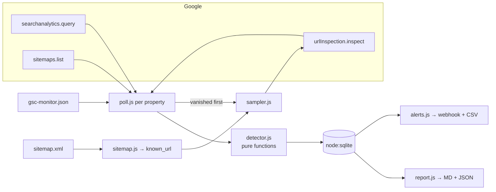

# gsc-coverage-monitor

[](https://github.com/mehranmoghadasi/gsc-coverage-monitor/actions/workflows/node.js.yml)
[](https://nodejs.org)
[](LICENSE)
[-06B6D4)](package.json)

> For agencies and in-house SEOs who find out a client's key page dropped out of Google three weeks after it happened: `gsc-monitor` polls every Search Console property you manage, spots pages that vanished from search, confirms *why* with URL Inspection, and posts one digest to Slack — using only GSC endpoints that actually return data.

```
$ gsc-monitor poll

▶ Demo HVAC Co (sc-domain:demo.example.com)
  analytics: 35 days, 212 pages in baseline, 1 vanished
  sitemaps: 1 submitted, 0 new URLs discovered
  inspection: 50/50 URLs checked
  3 new issue(s) · 214 URLs tracked

*GSC Coverage Monitor — 3 new issues*

*Demo HVAC Co*
🔴 Impressions collapsed — 4,600 → 1,800 impressions/day (−60.9%)
🔴 Page vanished from search — https://demo.example.com/services/furnace-repair — 350/day → 0/day impressions (320 clicks in baseline)
🔴 URL dropped out of the index — https://demo.example.com/services/furnace-repair — Submitted and indexed → Excluded by ‘noindex’ tag · robots: ALLOWED

✔ alert sent to webhook
```

## The Problem

Search Console emails you about *new* coverage errors, but not about a page that quietly stopped being indexed, a template change that shipped a `noindex`, or a sitemap that lost half its URLs after a CMS migration. The Pages report in the UI is aggregated and lags; there is no API for it. Practitioners end up checking properties by hand ([r/TechSEO: "How do you monitor indexing across 30 client sites?"](https://www.reddit.com/r/TechSEO/search/?q=monitor+indexing+clients)) or paying for enterprise crawlers. The signal that matters — *this page used to get traffic and now gets none, and Google says it is no longer indexed* — is available through the API, just not in one place.

## What changed in v2 (and why v1 never alerted)

v1 of this tool read `sitemap.contents[].indexed` from the Sitemaps API. Google's reference marks that field **deprecated**; it returns nothing, so v1 recorded 0 indexed URLs forever and its regression detector never fired. v2 is rebuilt on three endpoints that are current and documented:

| Signal | Endpoint | What it tells you |
|---|---|---|
| Impression collapse (site) | `searchanalytics.query` by date | 28-day baseline vs last 7 days, lag-aware |
| Vanished pages | `searchanalytics.query` by page | pages with ≥20 baseline impressions and ~0 now |
| Index-state flips | `urlInspection.index.inspect` | indexed → noindex / 404 / robots / canonical changed |
| Sitemap health | `sitemaps.list` (top-level `errors`, `warnings`, `isPending`) | submitted-count drops, new errors, never fetched |

## How this differs

- **Google's own emails** only cover new *errors*; they say nothing about pages that silently went from indexed to "Crawled – currently not indexed".
- **Screaming Frog / Sitebulb** crawl your site; they don't know what Google *did* with it unless you connect the URL Inspection API and run it by hand per site.
- **Ahrefs / Semrush / BrightLocal alerts** work per site; this runs across every property one service account can see, with one SQLite file and one webhook.
- **Existing GSC CLI/API wrappers** (`gsc-api`, `better-search-console`, `gsc-agent-cli`) expose the endpoints; this one adds the baseline/recent windows, the "vanished → inspect first" prioritisation, quota budgeting, history, and de-duplicated alerting on top.

## Features

- Multi-property: one config file, one service account, one database
- Lag-aware windows (`dataLagDays`, default 3) so half-finished days never trigger false drops
- Vanished-page detection normalised to impressions/day, so 28-day vs 7-day windows compare fairly
- URL Inspection budget spent where it matters: vanished pages first, then never-inspected, then stalest — capped well under the 2,000/day quota
- Transition detection on stored inspection history: `index_lost`, `robots_blocked`, `canonical_mismatch`
- Sitemap monitoring on the fields that exist: submitted count, errors, warnings, pending
- One Markdown digest per run to Slack / Discord / Teams via incoming webhook; `alerts.csv` always
- Same-day de-duplication: re-running `poll` never re-alerts the same issue
- `report` writes Markdown + JSON for the last N days; `status` gives one line per property
- Exit code 1 when new issues are found, so a cron or CI step can fail loudly
- Built on Node's built-in `node:sqlite` and test runner — a single runtime dependency (`googleapis`)
- 19 tests including a full simulated incident through the real pipeline (`tests/poll.test.js`)

## Architecture



`gsc.js` is the only module that imports `googleapis`; `poll.js` receives it as an injected `api` object, which is how the incident test runs the real pipeline against a fake Google. `detector.js` is pure and has no I/O.

## Tech Stack

- Node.js 22.13+ (ESM, `node:sqlite`, `node:test`, `util.parseArgs`)
- `googleapis` (Webmasters v3 + Search Console v1)
- SQLite (WAL) for history; no ORM

## Installation

```bash
git clone https://github.com/mehranmoghadasi/gsc-coverage-monitor.git
cd gsc-coverage-monitor
npm install
cp .env.example .env
cp gsc-monitor.example.json gsc-monitor.json
```

1. In Google Cloud, create a service account and download its JSON key; enable the **Google Search Console API**.
2. In each Search Console property, add the service account's email as a user (Restricted is enough).
3. Put the key path in `.env` (`GOOGLE_APPLICATION_CREDENTIALS`) and list your properties in `gsc-monitor.json`. Use `sc-domain:example.com` for domain properties or the exact `https://…/` for URL-prefix properties.

## Usage

**Try it without credentials** — the fake API simulates a real incident:

```bash
GSC_MONITOR_FAKE_API=./examples/fake-api.js GSC_MONITOR_DB=./data/demo.db \
  npx gsc-monitor poll --config examples/gsc-monitor.demo.json --dry-run --today 2026-09-08   # baseline day
GSC_MONITOR_FAKE_API=./examples/fake-api.js GSC_MONITOR_DB=./data/demo.db \
  npx gsc-monitor poll --config examples/gsc-monitor.demo.json --dry-run --today 2026-09-19   # incident day
```

**Daily monitoring** (cron, GitHub Actions, or any scheduler):

```bash
npx gsc-monitor poll                 # all properties; alerts to $ALERT_WEBHOOK_URL
npx gsc-monitor poll --property sc-domain:client.com --dry-run
```

**Reports and ad-hoc checks:**

```bash
npx gsc-monitor status
npx gsc-monitor report --days 30 --out reports/
npx gsc-monitor inspect https://client.com/pricing https://client.com/blog/post
```

Example crontab (07:30 daily, after Google finalises the previous days):

```
30 7 * * * cd /srv/gsc-monitor && npx gsc-monitor poll >> logs/poll.log 2>&1
```

## Configuration

```json
{
  "properties": [{ "siteUrl": "sc-domain:example.com", "label": "Example Co", "sitemaps": ["https://example.com/sitemap.xml"] }],
  "analytics":  { "dataLagDays": 3, "baselineDays": 28, "recentDays": 7, "siteDropThresholdPct": 25, "pageMinBaselineImpressions": 20 },
  "inspection": { "dailyBudget": 50, "recheckIntervalDays": 14 },
  "sitemaps":   { "submittedDropThresholdPct": 20 }
}
```

`dailyBudget` is per property per run; the URL Inspection quota is 2,000/day/property, and the tool refuses configs above it.

## Sample Output

`reports/report-2026-09-19.md`

| Property | Days | Clicks | Impressions | Known URLs | Inspected PASS | Inspected other |
|---|---:|---:|---:|---:|---:|---:|
| Demo HVAC Co | 28 | 2,590 | 109,200 | 214 | 201 | 13 |

| Detected | Severity | Type | Subject | Detail |
|---|---|---|---|---|
| 2026-09-19 | high | index_lost | …/services/furnace-repair | Submitted and indexed → Excluded by ‘noindex’ tag |
| 2026-09-19 | high | page_vanished | …/services/furnace-repair | 350/day → 0/day impressions (320 clicks in baseline) |

## Limitations (honest ones)

- Search Analytics data is anonymised and lags 2–3 days; very-low-traffic pages can't be monitored via impressions and rely on the inspection rotation instead.
- URL Inspection is sampled, not exhaustive: with the default budget a 5,000-URL site is fully re-inspected roughly every 100 days, but any page that loses impressions is inspected the same day.
- There is still no API for the aggregate Pages report; this tool reconstructs the useful part of it from the three endpoints above.

## Related Projects

- [ga4-event-auditor](https://github.com/mehranmoghadasi/ga4-event-auditor) — the analytics counterpart: catches tracking regressions the way this catches indexing regressions
- [agency-report-builder](https://github.com/mehranmoghadasi/agency-report-builder) — drop `report-*.json` into the client report's technical-health section

## Roadmap

1. `--backfill N` to seed history from the last N days of Search Analytics on first run
2. Per-property webhook overrides and a weekly "all clear" summary
3. Query-level vanished detection (keywords that stopped appearing) alongside pages
4. Optional Bing Webmaster Tools source
5. Small HTML dashboard over the SQLite file

## Project Structure

```
gsc-coverage-monitor/
├── src/
│   ├── index.js            # CLI (poll · report · status · inspect)
│   ├── config.js           # JSON config + .env loading, validation, defaults
│   └── lib/
│       ├── gsc.js          # Google API adapter (only file importing googleapis)
│       ├── poll.js         # one monitoring pass; api injected
│       ├── detector.js     # pure regression logic
│       ├── sampler.js      # inspection budget allocation
│       ├── sitemap.js      # sitemap / index enumeration
│       ├── db.js           # node:sqlite schema + queries
│       ├── alerts.js       # digest formatting, webhook, CSV
│       ├── report.js       # Markdown + JSON reports
│       └── dates.js
├── tests/                  # node:test — detector, db, sitemap, alerts, full poll incident
├── examples/               # fake-api.js + demo config (no credentials needed)
├── ci/node.yml             # GitHub Actions workflow (also installed at .github/workflows/)
├── gsc-monitor.example.json
└── .env.example
```

## Contributing

Issues and PRs welcome — especially real `coverageState` strings you've seen that the bucketing in `detector.js` should handle.

## License

MIT — see [LICENSE](LICENSE).

## About the Author

**Mehran Moghadasi** — Digital Marketing & Brand Manager (SEO · Google Ads · Meta Ads · Social Media), Calgary, AB.
[github.com/mehranmoghadasi](https://github.com/mehranmoghadasi) · [linkedin.com/in/mehranmoghadasi](https://www.linkedin.com/in/mehranmoghadasi)
