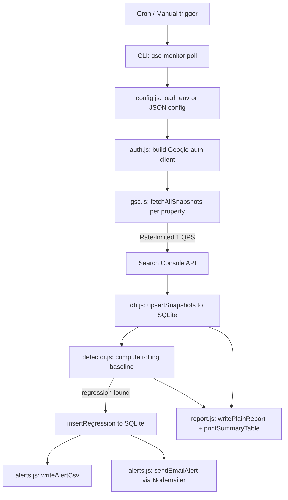

# gsc-coverage-monitor

[](LICENSE)
[](https://nodejs.org/)
[](https://github.com/mehranmoghadasi/gsc-coverage-monitor)

> Poll unlimited Google Search Console properties on a schedule, store multi-year coverage history in SQLite, and get email + CSV alerts the moment indexed URLs drop — before your clients notice.

---

## Mockup

```
 GSC Coverage Monitor — Cycle Report
 Sat May 16 2026  |  7 properties polled

─────────────────────────────────────────────────────────────────────────
 Properties: 7  |  Total Indexed: 124,390  |  Coverage: 91.2%
─────────────────────────────────────────────────────────────────────────

 ✔ OK   https://acme-hardware.com/
         Indexed: 4,210 / 4,500 submitted  |  Errors: 0

 ✔ OK   https://starview-legal.ca/
         Indexed: 380 / 420 submitted  |  Errors: 0

 ✖ REGRESSION   https://presto-ecommerce.com/
         Indexed: 18,200 / 42,000 submitted  |  Errors: 12

─────────────────────────────────────────────────────────────────────────
 ⚠  1 regression detected:

 ⚠️  DROP DETECTED — https://presto-ecommerce.com/
   Date:              2026-05-16
   Baseline (avg):    24,800 indexed URLs
   Current:           18,200 indexed URLs
   Drop:              26.6% (−6,600 URLs)

→  Alert CSV  written to output/gsc-alerts-2026-05-16.csv
→  Email sent to admin@myagency.ca
```

---

## The Problem

Agencies managing 20–100 client Google Search Console properties have no good way to catch indexation cliffs across all of them at once. The GSC web UI only shows one property at a time, coverage alerts are vague, and **the API retains only 16 months of history** — meaning long-term trends disappear unless you store them yourself.

Discussed in depth by SEOs at [r/bigseo](https://www.reddit.com/r/bigseo/) and [Coupler.io's GSC API guide](https://blog.coupler.io/google-search-console-api/): *"There's no open-source tool that aggregates coverage across dozens of properties and keeps history beyond Google's 16-month window."*

---

## The Solution

`gsc-coverage-monitor` is a Node.js CLI that runs on a cron schedule, polls every configured GSC property via the Search Console API, stores daily snapshots in a local SQLite database (yours forever), and automatically detects when indexed URL counts drop beyond a configurable threshold. When a regression is found, it sends an email and writes a CSV alert — all before your client opens their browser.

Unlike `houtini-ai/better-search-console` (SQLite dump only), this tool adds a **drift detection + alerting layer** on top of the stored data.

---

## Features

- **Multi-property polling** — configure unlimited GSC properties, polled sequentially to respect the 1 QPS rate limit with automatic exponential-backoff retry.
- **Persistent SQLite history** — every daily snapshot is stored locally, overcoming Google's 16-month API retention cap. Runs forever.
- **Configurable regression detection** — rolling baseline mean over N days (default 7); flags drops ≥ X% (default 5%). Special `total_loss` alert type when indexed count hits zero.
- **Email alerts via Nodemailer** — HTML + plain-text email with per-property breakdown and next-step checklist, sent automatically on regressions.
- **CSV exports** — daily snapshot CSV and regression alert CSV written to an output directory for import into reporting tools.
- **Plain-text cycle reports** — timestamped `.txt` report per cycle, ready for log aggregation.
- **Service account + OAuth2 support** — works with a Google Cloud service account JSON key or `gcloud`-generated application-default credentials.
- **Dry-run mode** — fetch and print without storing or alerting, for testing config.
- **`list` command** — enumerate all GSC properties the authenticated account can access.

---

## Architecture



**Trade-offs:** SQLite (via `better-sqlite3`) is chosen over Postgres for zero-infra setup — a cron job + single file is all that's needed. The synchronous API simplifies the poll loop without sacrificing correctness; the WAL journal mode keeps reads fast.

---

## Tech Stack

- **Language** — Node.js 18+ (ESM)
- **GSC API** — `googleapis` v140 (`webmasters` v3)
- **Storage** — `better-sqlite3` (SQLite, WAL mode)
- **CLI** — `commander` v12
- **Email** — `nodemailer` v6
- **CSV** — `fast-csv` v5
- **Terminal UI** — `chalk` v5
- **Testing** — `jest` v29 (ESM)

---

## Installation

**Prerequisites:** Node.js ≥ 18, a Google Cloud service account with Search Console read permissions, or `gcloud auth application-default login`.

```bash
# 1. Clone and install dependencies
git clone https://github.com/mehranmoghadasi/gsc-coverage-monitor.git
cd gsc-coverage-monitor
npm install

# 2. Set up credentials
#    Download a service account JSON key from Google Cloud Console and save as:
cp /path/to/your-service-account.json ./credentials.json
#    OR use application-default credentials:
#    gcloud auth application-default login

# 3. Create a .env file
cp .env.example .env
# Edit .env with your properties, SMTP settings, and credential path

# 4. Test with dry-run
node src/index.js poll --dry-run

# 5. Run a real poll cycle
node src/index.js poll
```

**Cron setup (recommended daily at 8 AM):**
```bash
0 8 * * * cd /path/to/gsc-coverage-monitor && node src/index.js poll >> logs/cron.log 2>&1
```

---

## Usage

### 1. Poll all properties
```bash
node src/index.js poll
# With a specific config file:
node src/index.js poll --config ./configs/client-portfolio.json
# Dry-run (no writes, no alerts):
node src/index.js poll --dry-run
```

**Expected output:**
```
🔍 GSC Coverage Monitor — Poll Cycle

Polling 5 properties...
Snapshots stored → /home/user/gsc-monitor.db
 ✔ OK  https://example.com/  (4,210 indexed)
 ⚠ REGRESSION  https://presto-ecommerce.com/  (−26.6%)
Alert CSV → output/gsc-alerts-2026-05-16.csv
✉  Alert email sent to admin@myagency.ca
✔  Poll cycle complete.
```

### 2. Print report from stored data
```bash
node src/index.js report
node src/index.js report --days 14
```

### 3. List accessible GSC properties
```bash
node src/index.js list
```

---

## Sample Output

**`output/gsc-alerts-2026-05-16.csv`:**
```csv
site_url,detected_date,type,baseline_avg,current_indexed,drop_pct,drop_absolute
https://presto-ecommerce.com/,2026-05-16,threshold,24800,18200,26.6,6600
```

**`output/gsc-snapshot-2026-05-16.csv`:**
```csv
site_url,date,submitted_urls,indexed_urls,error_urls,warning_urls,excluded_urls,sitemap_count
https://acme-hardware.com/,2026-05-16,4500,4210,0,0,290,2
https://presto-ecommerce.com/,2026-05-16,42000,18200,12,3,23785,5
```

---

## Roadmap

1. **HTML dashboard** — browser-accessible coverage trend charts using Chart.js + SQLite REST bridge
2. **Slack webhook alerts** — push regression notices to a team channel in addition to email
3. **Multi-account support** — manage properties across multiple Google accounts via credential switching
4. **Configurable schedules per property** — poll high-priority properties hourly, others daily
5. **GSC Search Analytics trending** — extend snapshots to include click/impression/CTR trends alongside coverage
6. **Docker + cron image** — one-command deployment for teams that prefer containerised tooling

---

## Project Structure

```
gsc-coverage-monitor/
├── README.md
├── LICENSE
├── .gitignore
├── .editorconfig
├── package.json
├── .env.example
├── src/
│   ├── index.js             # CLI entry (Commander commands)
│   ├── config.js            # Config loader (env + JSON file)
│   └── lib/
│       ├── auth.js          # Google OAuth2 / service account auth
│       ├── gsc.js           # Search Console API wrapper
│       ├── db.js            # SQLite data layer (better-sqlite3)
│       ├── detector.js      # Regression detection engine
│       ├── alerts.js        # Email + CSV alert dispatch
│       └── report.js        # Terminal + text report generator
├── tests/
│   ├── detector.test.js
│   └── db.test.js
├── docs/
│   ├── ARCHITECTURE.md
│   └── USAGE.md
└── examples/
    └── sample_coverage_report.csv
```

---

## Contributing

Issues and PRs are welcome. Please open an issue first to discuss significant changes — particularly around the detection algorithm or database schema.

## License

MIT — see [LICENSE](LICENSE)

## About the Author

[Mehran Moghadasi](https://github.com/mehranmoghadasi) is a digital marketing specialist with deep expertise in SEO, PPC, and marketing analytics infrastructure. This tool was built to solve a real agency workflow problem encountered while managing multi-property GSC portfolios.
